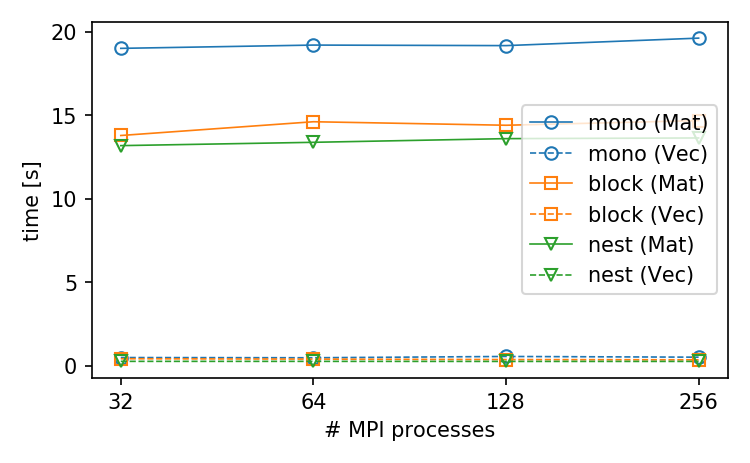
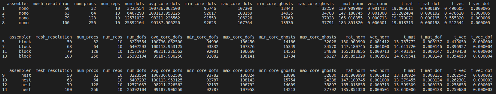
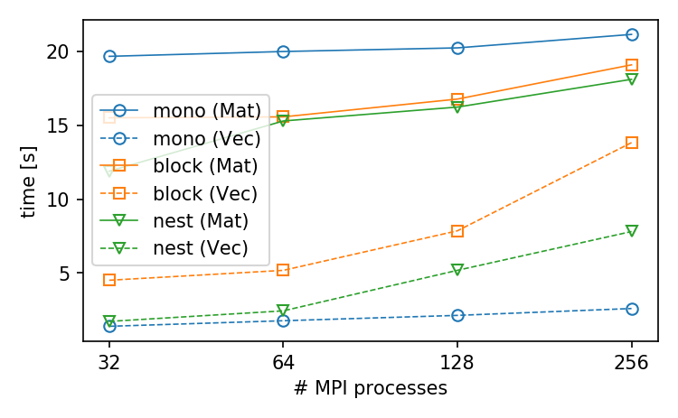
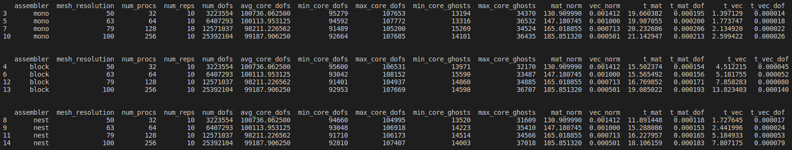

# dolfinx-hpc-assembly

Tests for comparison of parallel efficiency of assembly routines in
FEniCS/DOLFINX (<https://www.fenicsproject.org/>).

## Weak scaling test

The list of options for the weak scaling test can be obtained by running
```bash
python3 test_assembly_routines.py -h
```

*Remark*: pandas (<https://pandas.pydata.org/>) has to be installed, e.g. with
`python3 -m pip install pandas`, in order to store the results in a CSV file that can be further
postprocessed with
```bash
./output_assembly_routines.py <filename>
```

### Results

The following results were obtained by running
```bash
test_assembly_routines.py -t <mono|block|nest> -r 10 --dofs 100000 --cpp-forms
```
in parallel. The last option `--cpp-forms` ensures that all forms are converted to
`dolfinx.cpp.fem.Form` before passing them to the chosen assembly routine.



**Figure 1:** MPI-averaged wall time for matrix/vector assembly using the individual routines
invoked with (bi)linear forms of the type `dolfinx.cpp.fem.Form`.



**Table 1:** Data for the case shown in Figure 1.

### Be careful!

Things can go wrong if the option `--cpp-forms` is omitted. In that case, the forms remain
of the type `ufl.form.Form` at the time of passing them to the assembly routine which can lead to
an I/O overhead (due to dynamic linking of cached forms). This becomes perceptible with MPI
internode communication, especially for block/nest assemblers.



**Figure 2:** MPI-averaged wall time for matrix/vector assembly using the individual routines
invoked with (bi)linear forms of the type `ufl.form.Form`.



**Table 2:** Data for the case shown in Figure 2.
